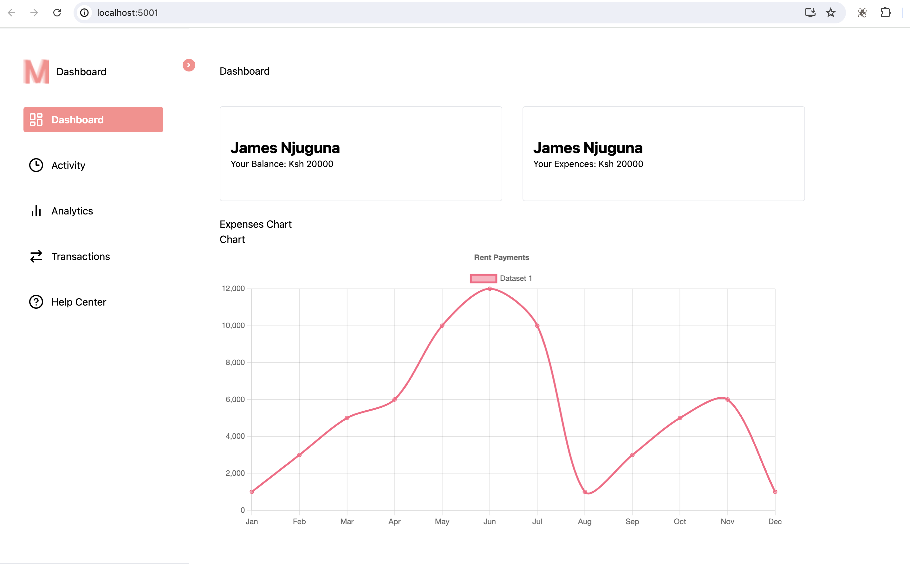
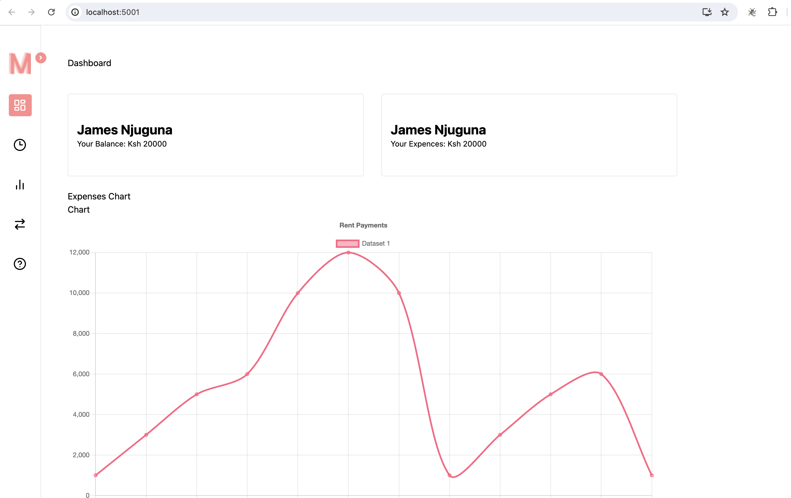

# React Tailwind Dashboard
A dashboard developed using ReactJS, Tailwind CSS and Framer Motion.
The main aim of this dashboard is to demonstrate the functionality of collapsible menus.

## Available Scripts

In the project directory, you can run:

### `npm start`

Runs the app in the development mode.\
Open [http://localhost:3000](http://localhost:3000) to view it in your browser.

## Dashboard Menu Component

### Open Menu

### Collapse Menu

